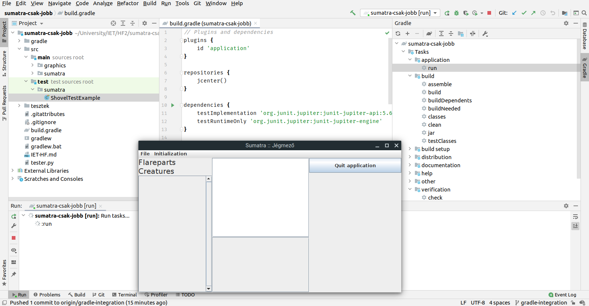

# Build keretrendszer és CI beüzemelése

## Build keretrendszer: Gradle

Ennél a résznél a Gradle mellett döntöttem, részben azért, mert ezzel már többször találkoztam (ellentétben a Mavennel), részben pedig azért, mert konfigurációs fájlhoz én túlságosan átláthatatlannak vélem az XML alapú dolgokat (így a Mavent is).

Az integráció nem volt túlságosan bonyolult, egy `gradle init` parancsot ki kellett adnom a projekt mappájában, kicsit átstruktúrálnom az *src* mappát, és lényegében már működött is a fordítás és a tesztelés.

Tanulságnak talán azt tudom felhozni, hogy meglepően egyszerű volt felconfigolni a projektet, hogy Gradle-t használjon. Eddig mindig csak úgy használtam ilyen keretrendszereket, hogy a projektet már azzal együtt hoztam létre, vagy azzal együtt kaptam, soha nem kellett egy már létező projekthez adnom ilyesmi támogatást. Értem, hogy pont az a célja ezeknek, hogy megkönnyítsék a fordítást, futtatást, tesztelést, stb-t, de mégis kellemes meglepetés volt, hogy egy kis utánajárással egyből össze tudtam rakni egy működő konfigurációt.

*~ Attila*
