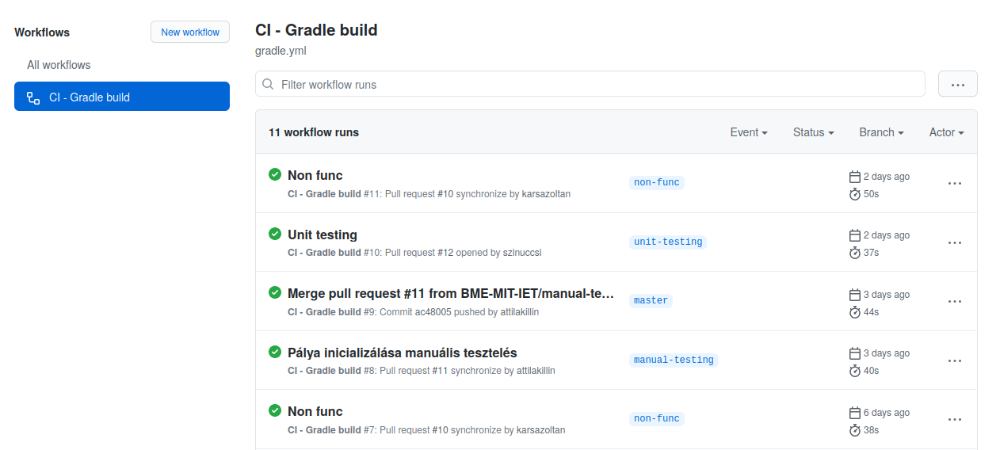

# Build keretrendszer és CI beüzemelése

## Build keretrendszer: Gradle

Ennél a résznél a Gradle mellett döntöttem, részben azért, mert ezzel már többször találkoztam (ellentétben a Mavennel), részben pedig azért, mert konfigurációs fájlhoz én túlságosan átláthatatlannak vélem az XML alapú dolgokat (így a Mavent is).

Az integráció nem volt túlságosan bonyolult, egy `gradle init` parancsot ki kellett adnom a projekt mappájában, kicsit átstruktúrálnom az `src` mappát, és lényegében már működött is a fordítás és a tesztelés.

## Continuous Integration: GitHub Actions

Ezt mindössze pár perc volt felkonfigurálni, és a működés megértése sem volt bonyolult. Alapvetően a workflow csak egy `gradle build` ellenőrzést végez, viszont mivel ez a Gradle taszk függ a `test` taszktól is, így a létrehozott unit tesztjeink is le fognak futni minden egyes kiértékelésnél.

Tanulságnak talán azt tudom felhozni, hogy meglepően egyszerű volt felconfigolni a projektet, mind a build keretrendszer, mind a CI részről. Eddig mindig csak úgy használtam ilyen keretrendszereket, hogy a projektet már azzal együtt hoztam létre, vagy azzal együtt kaptam, soha nem kellett egy már létező projekthez adnom ilyesmi támogatást.
Tény, hogy az ilyen rendszereknél sokszor cél az is, hogy könnyű legyen a beállításuk, de így is kellemes meglepetésként ért, hogy mennyire könnyű is ez.

*Attila*
