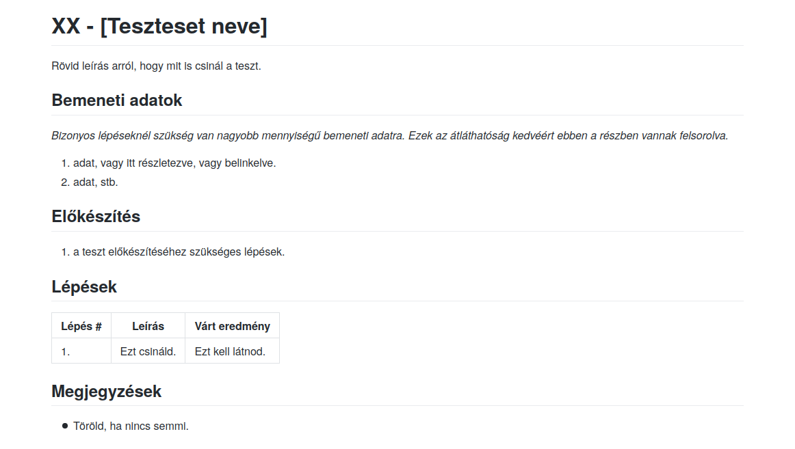

# Manuális tesztek tervezése, végrehajtása és dokumentálása

A teszteket Markdown formátumban készítettük el, mert azokra jól működik a verziókezelés, szépen lehet őket formázni, és van már vele tapasztalatunk.
A lent látható template volt az első lépés, ez több iteráción is keresztülment, míg elértünk a mostani kinézetéhez.

Mivel a program logikai részével a unit tesztelők már foglalkoztak, így mi inkább a grafikus felületre koncentráltunk, és azt ellenőriztük, hogy laikus szemmel nézve érthetőek-e a felületelemek, és a viselkedésük megfelel-e az elvárásoknak.

Az mindenképpen elmondható, hogy manuális teszteket készíteni igencsak manuális feladat, a dokumentálás egészen hosszadalmas tud lenni.
Ennek ellenére volt értelme ezeknek a teszteknek, több olyan pont is volt, ahol ez vagy az nem működött megfelelően, vagy laikus felhasználó számára érthetetlen volt egy-egy menüpont.

Egészen sok hibát találtunk a manuális tesztekkel, összefoglalva a megtalált hibák:
- Létre lehet hozni instabil mezőt 0 kapacitással 
- Több tárgyat is létre lehet hozni egy mezőn.
- Ha mezők létrehozása előtt próbálunk tárgyat létrehozni, akkor hibás a viselkedés.
- Néha nem működik a pálya mentése és betöltése.
- El lehet indítani a játékot csak medvékkel, és ilyenkor kifagy a program.
- Játszhatatlanná lehet tenni a játékot ha megpróbálunk új pályát készíteni egy futó játék közben.
- Ha balra vagy felfele kihúzunk egy mezőt, akkor azt már sose tudjuk elérni és látni.