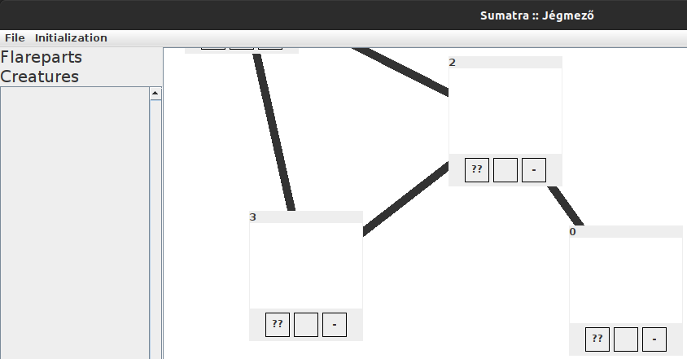
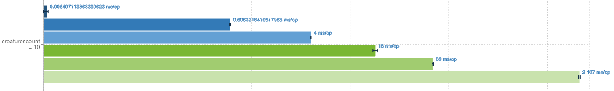
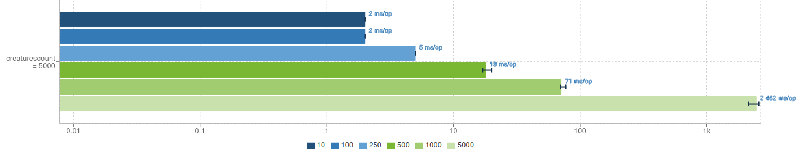

# Nem-funkcionális tesztek értékelése

## Felület használhatósága
### Mezők hozzáadása
Az Initialization/Map menüpont esetén a következő megállapításokra jutottam a felület használhatósága és kezelhetőségével kapcsolatban.

Mezők hozzáadásánál mindkét számbeviteli mező esetén egy bug vehető észre: Ha az alapértelmezett nullás értéket felülírjuk valamilyen nullánál nagyobb számmal, akkor a továbbiakban a szám első számjegye már nem állítható be, nem törölhető. Csak a felugró ablak bezárása után. Ekkor nyilvánvalóan az addigi beállításaink elvesznek. 

A felhasználók szempontjából jobb lenne ha az előző bekezdésben említett beviteli mezők esetén megjeleníteni, melyik mire vonatkozik: az egyikkel a táblamezőt fedő hóvastagság, a másik beviteli mezővel pedig a teherbírását lehet beállítani. Ugyanakkor ez a lehetőség csak _unstable tile_ esetén kell, így be lehetne állítani, hogy csak ez esetben lehssen ezt az opciót megadni.

### Játéktér
A játék inicializálása után a felvett mezőktől függően előfordulhat olyan megjelenítés, amikor az egyes szomszédsági viszonyok nem láthatóak a mezők elhelyezkedése miatt. Érdemesebb valamilyen síkbarajzoló algoritmust felhasználni ezek elrendezésére. 

Ha a felhasználó maga akarja átrendezni a játékteret, akkor azt a szokványos egérmozdulatokkal megteheti. Viszont ha a felhasználó felfele vagy balra húzza a mezőket és kihúzza őket az ablakból, akkor azok már nem rendezhetőek vissza, mert a keret nem követi le a mozgásukat.

Ilyen eset látható a lenti képen, egy mező ki lett húzva a keretből, azt már nem lehet visszaállítani.

Ha a játékban 9-nél több karakter van és ezek mind egy táblán vannak, akkor csak az utolsó 9 karakter jeleníthető meg a mezőn. Illetve a részletező oldalon sem látható, hogy a többi karakter pontosan hol, melyik mezőn áll, esetleg ugyanazon. 

### Betöltés
A játék használhatóságát a grafikai rendszer teljesítményével is felmértem. A játék betöltéséhez létrehoztam egy segéd script-et, amivel könnyen lehet a játék inicializálásához szükséges konfigurációs fájlt előállítani. 

A segédprogram: `nonfunctional/bigmap/makemap.py`, melynek kettő paramétert kell megadni a parancssorból: `makemap.py {kimeneti fájl} {mezők száma}` A program egy bemeneti, a mezőket leíró fájlt készít, a mezők teljes gráfot alkotnak. Ez a fájl a `File/Load` menüvel betölthető.

A kezelhetőség szempontjából az alábbi teszteket futtatam:
 * `python3 makemap.py big50.txt 50` a felület könnyedén használható
 * `python3 makemap.py big100.txt 100` a felület könnyedén használható, kicsi akadás
 * `python3 makemap.py big1000.txt 1000` a felület nem használható érdemben

## JMH
Java Microbenchmark Harness: [github](https://github.com/openjdk/jmh)

Az eszközzel néhány alapvető teljesítménymérést lehet elvégezni a kódon.
A JMH a következő adatokat tudja kiszámítani:
* Átbocsátás (Throughput) 
* Átlagos idő (Average time) 
* Mintaidő (Sample time) 
* Első futás (Single shot time)

Az eszközzel továbbá az alábbi opciókat tudjuk megadni a benchmark futtatásakor:
* Warmup iterációk száma (hányszor futtassa elő - a kód optimalizálását közben végzi a JIT)
* Fork iteráció (a háttérben futó egyéb CPU tevékenységek, GC viselkedés... tompitására)
* Tiszta iterációk száma
* a mérés elvégzése előtti inicializáló lépések

### Futtatás

A tesztet a gradle `jmhJar` taszk használata után futtatható. A teszt futása körülbelül 1 órát vesz igénybe. 

### A játék inicializálásának mérése
A lenti eredmények _I7 8850_ processzor és _16 GB 24000Mhz_ memória konfiguráció mellett született.

Az `src/jmh/java/sumatra/LoadBenchmark` a kódból történő játékbetöltést vizsgálja: a mezők hozzáadása és a szomszédsággi viszonyok kiépítése mennyi ideig tart különböző beállításokkal, továbbá néhány karaktert is elhelyez a mezőkön.

Ennek az eredménye látható a `nonfunctional/bigmap/results.txt` fájlban. Az átlagos futási időt szeretném kiemelni:

A kék-zöld árnyalatok a létrehozott mezők számához viszonyítja az átlagos futási időt, az első képen 10 db karakter létrehozásával, míg a 2. képen már 5000 db karakter létrehozása történt. (A skála logaritmikus, diagram ezzel a programmal készült: [jmh.morethan.io](https://jmh.morethan.io/))

Jól látható hogy a mezők beállítása tartott nagyon sokáig a létrehozott karakterek számától függetlenül, hiszen a szomszédsági viszonyok száma `n*n` komplexitású `n` db mező esetén. A karakterek száma csak a kapott értékek szórását befolyásolta minimálisan. 
